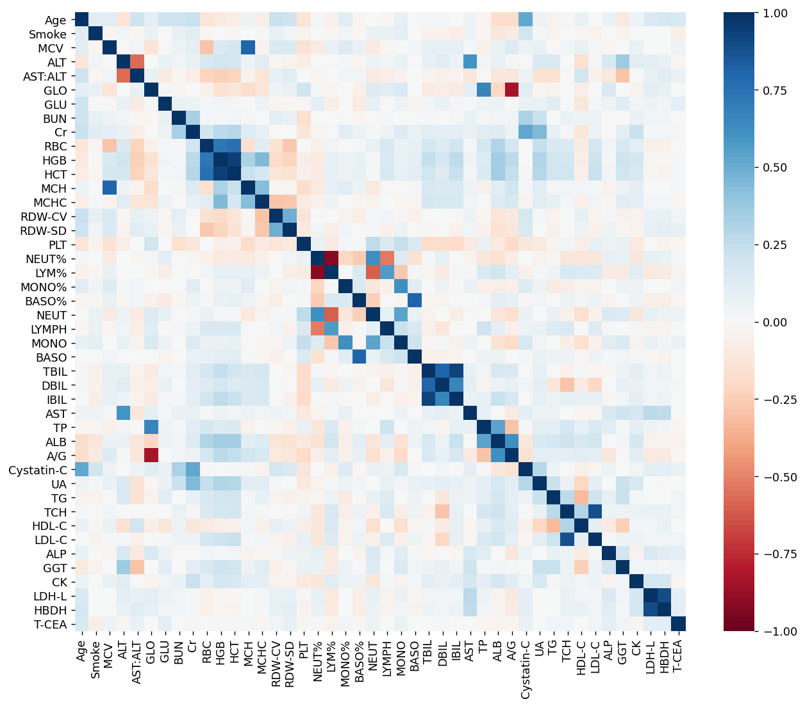
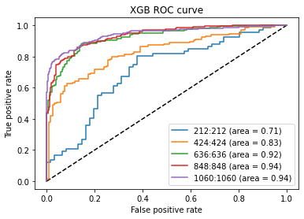
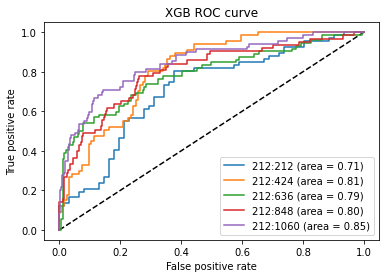

# Lung Cancer Prediction

## Data preprocessing

### 1. 对源文件进行修改

* 录入错误
* 格式错误：str->float

### 2. 计算横轴缺失比例

缺失__以下，AB组剩余的样本数量

| MissingRate | A_left | B_left |
| ----------- | ------ | ------ |
| 0           | 0      | 0      |
| 0.05        | 2519   | 2481   |
| 0.1         | 3789   | 3738   |
| 0.15        | 3962   | 3796   |
| 0.2         | 3986   | 3796   |
| 0.25        | 4004   | 3796   |
| 0.3         | 4011   | 3796   |
| 0.35        | 4012   | 3796   |
| 0.4         | 4030   | 3796   |
| 0.45        | 4069   | 3798   |
| 0.5         | 4123   | 3817   |
| 0.55        | 4182   | 4085   |
| 0.6         | 4185   | 4087   |
| 0.65        | 4187   | 4087   |
| 0.7         | 4188   | 4087   |
| 0.75        | 4189   | 4087   |
| 0.8         | 4193   | 4087   |
| 0.85        | 4213   | 4090   |
| 0.9         | 4222   | 4095   |
| 0.95        | 4642   | 4099   |
| 1           | 4642   | 4099   |

最终保留横轴缺失20%以下的样本

### 3. 计算纵轴缺失比例

|                   | A        | B        | Delete |
| ----------------- | -------- | -------- | ------ |
| A=Case, B=Control | 0        | 0        |        |
| Origin            | 0        | 0        |        |
| A=male B=female   | 0        | 0        |        |
| Age               | 0        | 0        |        |
| Pattern           | 0.218992 | 1        |        |
| TNM               | 0.752799 | 1        | Y      |
| Smoke             | 0.025409 | 0        |        |
| RBC               | 0.108958 | 0.003414 |        |
| HGB               | 0.10702  | 0.003414 |        |
| HCT               | 0.10745  | 0.003414 |        |
| MCV               | 0.107666 | 0.003414 |        |
| MCH               | 0.107666 | 0.003414 |        |
| MCHC              | 0.107666 | 0.003414 |        |
| RDW-CV            | 0.107666 | 0.003414 |        |
| RDW-SD            | 0.107881 | 0.003414 |        |
| PLT               | 0.10745  | 0.003414 |        |
| PCT               | 0.480835 | 1        | Y      |
| MPV               | 0.483204 | 1        | Y      |
| P-LCR             | 0.483635 | 1        | Y      |
| PDW               | 0.483204 | 1        | Y      |
| WBC               | 0.108958 | 0.003414 |        |
| NEUT%             | 0.107881 | 0.003658 |        |
| LYM%              | 0.11025  | 0.003414 |        |
| MONO%             | 0.110896 | 0.003901 |        |
| EO%               | 0.112834 | 0.006096 |        |
| BASO%             | 0.120155 | 0.030237 |        |
| AC%               | 0.994186 | 1        | Y      |
| NEUT              | 0.11068  | 0.003658 |        |
| LYMPH             | 0.109604 | 0.003414 |        |
| MONO              | 0.111111 | 0.003901 |        |
| EO                | 0.113695 | 0.006096 |        |
| BASO              | 0.118432 | 0.030237 |        |
| TBIL              | 0.125969 | 0.073397 |        |
| DBIL              | 0.126615 | 0.073397 |        |
| IBIL              | 0.1264   | 0.073397 |        |
| ALT               | 0.125108 | 0.073397 |        |
| AST               | 0.125108 | 0.073397 |        |
| AST:ALT           | 0.125754 | 0.073397 |        |
| TP                | 0.125754 | 0.073397 |        |
| ALB               | 0.125538 | 0.073397 |        |
| GLO               | 0.125754 | 0.073397 |        |
| A/G               | 0.125754 | 0.073397 |        |
| GLU               | 0.130706 | 0.073397 |        |
| BUN               | 0.125538 | 0.073397 |        |
| Cr                | 0.125754 | 0.073397 |        |
| Cystatin-C        | 0.255168 | 0.073397 |        |
| UA                | 0.126184 | 0.073397 |        |
| TG                | 0.140181 | 0.073397 |        |
| TCH               | 0.140181 | 0.073397 |        |
| HDL-C             | 0.140181 | 0.073641 |        |
| LDL-C             | 0.140181 | 0.073397 |        |
| ALP               | 0.127476 | 0.073397 |        |
| GGT               | 0.125969 | 0.073397 |        |
| CK                | 0.143842 | 0.08754  |        |
| LDH-L             | 0.143196 | 0.08754  |        |
| HBDH              | 0.144272 | 0.08754  |        |
| Na                | 0.164944 | 0.90612  | Y      |
| K                 | 0.164729 | 0.90612  | Y      |
| Cl                | 0.164944 | 0.90612  | Y      |
| CO2Cp             | 0.165805 | 0.90612  | Y      |
| AG                | 0.166236 | 0.90612  | Y      |
| Beta-HB           | 0.61391  | 0.906364 | Y      |
| Ca                | 0.2177   | 0.90612  | Y      |
| Mg                | 0.216839 | 0.90612  | Y      |
| P                 | 0.218346 | 0.90612  | Y      |
| T-CEA             | 0.314815 | 0.003414 |        |
| T-CA199           | 0.628338 | 0.183858 |        |
| T-CA125           | 0.572567 | 0.65228  |        |
| T-CYFRA21-1       | 0.382429 | 0.448183 |        |
| T-NSE             | 0.419251 | 0.546696 |        |
| T-ESR             | 0.726529 | 1        | Y      |
| T-CRP             | 0.795004 | 1        | Y      |

最终纵轴缺失15%以上的特征被移除

### 4.异常值处理

1. 将年龄按照52岁以下，52-68岁，68岁以上分成Y(oung), M(iddle), 和O(ld)三组。
2. 特征HCT是以百分率形式表现的，将其中大于1的值替换为空值。
3. 按照来源，年龄和性别分组后分别计算其中位数并填入对应组的空值中。
4. 其余特征按照3倍上下四分位的方法处理过大和过小的值。
5. 按照来源对特征做t-test，将存在差异的特征视为收到batch effects的影响。

### 5. Batch Effects Correction

使用```SVA```包中的```comBat```模块修正批次效应，使用来源B作为参考。

### 6. 数据融合

将修正的数据融合进原数据中，按照是否患病分组做t-test，如下特征差异不显著，但主观上保留了Age：

```
['Age', 'WBC', 'EO%', 'EO']
```

## Feature Selection

采用皮尔森相关系数，卡方，互信息三种方法对特征进行初步的筛选，相关分析的结果如下图：



相关性较高的一对或一组特征中保留在卡方检验和互信息检验中排名较高的一个特征

最终，如下特征被移除：

```
['GLO', 'NEUT%', 'HCT', 'TCH','TBIL', 'IBIL', 'LDH-L']
```

## Model Traning

分别使用全数据(共7792)和只是用B来源(共424)的数据建模，机器学习模型选择为集成学习中的随机森林和极限梯度提升。

分别得到模型：rf_clf，xgb_clf，rf_clf_mini， xgb_clf_mini。

## 模型评估

|      | rf_clf             | xgb_clf            | rf_clf_mini        | xgb_clf_mini       |
| :--: | :----------------- | ------------------ | ------------------ | ------------------ |
| ACC  | 0.9414029084687767 | 0.9820359281437125 | 0.6352941176470588 | 0.788235294117647  |
| REC  | 0.9325657894736842 | 0.9720394736842105 | 0.6756756756756757 | 0.7837837837837838 |
| SPC  | 0.9509803921568627 | 0.9928698752228164 | 0.6041666666666666 | 0.7916666666666666 |
| AUC  | 0.9844820105075522 | 0.9973899697438784 | 0.7550675675675675 | 0.8502252252252253 |


## 样本量对模型的影响

使用XGBoost默认参数，未及逆行调参。

1. 数量对模型的影响:

来源B有case 212例，以此为基准，从A取样补入Case组，再从C取出相应数量的Control。

|      | 212:212            | 424:424            | 636:636            | 848:848            | 1060:1060          |
| ---- | ------------------ | ------------------ | ------------------ | ------------------ | ------------------ |
| ACC  | 0.65625            | 0.7490196078431373 | 0.8507853403141361 | 0.8565815324165029 | 0.8710691823899371 |
| REC  | 0.5522388059701493 | 0.6865671641791045 | 0.828125           | 0.828125           | 0.8377483443708609 |
| SPC  | 0.7704918032786885 | 0.8181818181818182 | 0.8736842105263158 | 0.8853754940711462 | 0.9011976047904192 |
| AUC  | 0.7093222412527527 | 0.8323670901689898 | 0.9249177631578948 | 0.9358942687747036 | 0.9436094698021176 |





2. 样本比例对模型的影响:

Case组数据源于B，从C取相应比例的Control，重点关注召回率的变化。

|      | 1:1                | 1:2                | 1:3                | 1:4                | 1:5                |
| ---- | ------------------ | ------------------ | ------------------ | ------------------ | ------------------ |
| ACC  | 0.65625            | 0.6963350785340314 | 0.8156862745098039 | 0.8364779874213837 | 0.8586387434554974 |
| REC  | 0.5522388059701493 | 0.5522388059701493 | 0.3888888888888889 | 0.3492063492063492 | 0.2898550724637681 |
| SPC  | 0.7704918032786885 | 0.7741935483870968 | 0.9836065573770492 | 0.9568627450980393 | 0.9840255591054313 |
| AUC  | 0.7093222412527527 | 0.8109051516610495 | 0.7865057680631451 | 0.8016184251478369 | 0.8457656155947585 |



