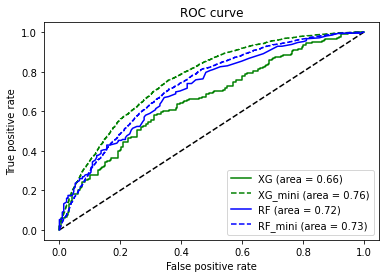

# Lung Cancer Prediction

## Data preprocess

### 1. Modify the source file

* input error
* type error: str->float

### 2. Missingness of rows

Calculate the amount of case and control group after filtering by different missing rate.

| MissingRate | A_left | B_left |
| ----------- | ------ | ------ |
| 0           | 0      | 0      |
| 0.05        | 2519   | 2481   |
| 0.1         | 3789   | 3738   |
| 0.15        | 3962   | 3796   |
| 0.2         | 3986   | 3796   |
| 0.25        | 4004   | 3796   |
| 0.3         | 4011   | 3796   |
| 0.35        | 4012   | 3796   |
| 0.4         | 4030   | 3796   |
| 0.45        | 4069   | 3798   |
| 0.5         | 4123   | 3817   |
| 0.55        | 4182   | 4085   |
| 0.6         | 4185   | 4087   |
| 0.65        | 4187   | 4087   |
| 0.7         | 4188   | 4087   |
| 0.75        | 4189   | 4087   |
| 0.8         | 4193   | 4087   |
| 0.85        | 4213   | 4090   |
| 0.9         | 4222   | 4095   |
| 0.95        | 4642   | 4099   |
| 1           | 4642   | 4099   |

keep the sample with missing rate below 20%

### 3. Missingness of columns

|                   | A        | B        | Delete |
| ----------------- | -------- | -------- | ------ |
| A=Case, B=Control | 0        | 0        |        |
| Origin            | 0        | 0        |        |
| A=male B=female   | 0        | 0        |        |
| Age               | 0        | 0        |        |
| Pattern           | 0.218992 | 1        |        |
| TNM               | 0.752799 | 1        | Y      |
| Smoke             | 0.025409 | 0        |        |
| RBC               | 0.108958 | 0.003414 |        |
| HGB               | 0.10702  | 0.003414 |        |
| HCT               | 0.10745  | 0.003414 |        |
| MCV               | 0.107666 | 0.003414 |        |
| MCH               | 0.107666 | 0.003414 |        |
| MCHC              | 0.107666 | 0.003414 |        |
| RDW-CV            | 0.107666 | 0.003414 |        |
| RDW-SD            | 0.107881 | 0.003414 |        |
| PLT               | 0.10745  | 0.003414 |        |
| PCT               | 0.480835 | 1        | Y      |
| MPV               | 0.483204 | 1        | Y      |
| P-LCR             | 0.483635 | 1        | Y      |
| PDW               | 0.483204 | 1        | Y      |
| WBC               | 0.108958 | 0.003414 |        |
| NEUT%             | 0.107881 | 0.003658 |        |
| LYM%              | 0.11025  | 0.003414 |        |
| MONO%             | 0.110896 | 0.003901 |        |
| EO%               | 0.112834 | 0.006096 |        |
| BASO%             | 0.120155 | 0.030237 |        |
| AC%               | 0.994186 | 1        | Y      |
| NEUT              | 0.11068  | 0.003658 |        |
| LYMPH             | 0.109604 | 0.003414 |        |
| MONO              | 0.111111 | 0.003901 |        |
| EO                | 0.113695 | 0.006096 |        |
| BASO              | 0.118432 | 0.030237 |        |
| TBIL              | 0.125969 | 0.073397 |        |
| DBIL              | 0.126615 | 0.073397 |        |
| IBIL              | 0.1264   | 0.073397 |        |
| ALT               | 0.125108 | 0.073397 |        |
| AST               | 0.125108 | 0.073397 |        |
| AST:ALT           | 0.125754 | 0.073397 |        |
| TP                | 0.125754 | 0.073397 |        |
| ALB               | 0.125538 | 0.073397 |        |
| GLO               | 0.125754 | 0.073397 |        |
| A/G               | 0.125754 | 0.073397 |        |
| GLU               | 0.130706 | 0.073397 |        |
| BUN               | 0.125538 | 0.073397 |        |
| Cr                | 0.125754 | 0.073397 |        |
| Cystatin-C        | 0.255168 | 0.073397 |        |
| UA                | 0.126184 | 0.073397 |        |
| TG                | 0.140181 | 0.073397 |        |
| TCH               | 0.140181 | 0.073397 |        |
| HDL-C             | 0.140181 | 0.073641 |        |
| LDL-C             | 0.140181 | 0.073397 |        |
| ALP               | 0.127476 | 0.073397 |        |
| GGT               | 0.125969 | 0.073397 |        |
| CK                | 0.143842 | 0.08754  |        |
| LDH-L             | 0.143196 | 0.08754  |        |
| HBDH              | 0.144272 | 0.08754  |        |
| Na                | 0.164944 | 0.90612  | Y      |
| K                 | 0.164729 | 0.90612  | Y      |
| Cl                | 0.164944 | 0.90612  | Y      |
| CO2Cp             | 0.165805 | 0.90612  | Y      |
| AG                | 0.166236 | 0.90612  | Y      |
| Beta-HB           | 0.61391  | 0.906364 | Y      |
| Ca                | 0.2177   | 0.90612  | Y      |
| Mg                | 0.216839 | 0.90612  | Y      |
| P                 | 0.218346 | 0.90612  | Y      |
| T-CEA             | 0.314815 | 0.003414 |        |
| T-CA199           | 0.628338 | 0.183858 |        |
| T-CA125           | 0.572567 | 0.65228  |        |
| T-CYFRA21-1       | 0.382429 | 0.448183 |        |
| T-NSE             | 0.419251 | 0.546696 |        |
| T-ESR             | 0.726529 | 1        | Y      |
| T-CRP             | 0.795004 | 1        | Y      |

Drop the features with more than 15% missingness.

### 4. Outlier

1. Split the data by age below 52，52-68，over 68, and defined as Y(oung), M(iddle), andO(ld).
2. HCT (hematocrit level) should be 0-1，replace >1 with NaN。
3. According to the source of data (hospital and  medical examination center)，age and sex, group the data and fill the NaN with median number of corresponding group.
4. In other features, the abnormal values (that are out the 3 times of  upper&lower quartile) will be replaced with mediate number.

### 5. Batch Effects Correction

The data from same group (case or control) but different sources (hospital and examination center) shows difference in numerical distribution, which is highly possibly caused by different machines used in two places. Some even can be tell by eye check. 

t-test is used here to check if there is significant difference between two sources. And the features that show difference will be selected to be corrected with the model `comBat` in ```SVA``` .

### 6. Merging

After correction, these features didn't not show different between case and control with t-test and dropped.

```
['WBC', 'EO%', 'EO']
```

## Feature Selection

 correlation analysis:

Some features are highly related with other feature. with the reference of R^2^-test and mutual information score, these features are removed.

```
['GLO', 'NEUT%', 'HCT', 'TCH','TBIL', 'IBIL', 'LDH-L']
```

## Model Training

### data split

1. According to data sources, A has 3728 samples, B has 212, C has 3798. A and B are case, C is control.
2. Select 212 samples from C, merge with B and define as dataset 1, denoted as X1, y1.
3. The rest C is combined with A as dataset 2, denoted as X2, y2.

### training
1. Cross validation and grid search are used on dataset 1 and dataset 2 for  training. Finally, rf_clf_mini, xgb_clf_mini and rf_clf, xgb_clf are got.
2. Algorithm is random forest and XGBoost,  assessment is recall.

### evaluation
Testing rf_clf and xgb_clf with dataset 1，rf_clf_mini and xgb_clf_mini and are tested with dataset 2.

|      | rf_clf              | xgb_clf               | rf_clf_mini        | xgb_clf_mini       |
| :--: | :------------------ | --------------------- | ------------------ | ------------------ |
| ACC  | 0.5377358490566038  | 0.5023584905660378    | 0.6669381107491856 | 0.6867535287730727 |
| REC  | 0.08490566037735849 | 0.0047169811320754715 | 0.6356425171866738 | 0.6485986250661026 |
| SPC  | 0.9905660377358491  | 1.0                   | 0.6999442275515895 | 0.7269938650306749 |
| AUC  | 0.7150787646849414  | 0.6608001067995729    | 0.7298051975438887 | 0.7642652562421048 |



###  Influence of sample size on Model 

Some tests.

1. Sample size:

   With the increase of sample size, the model learns more and more difference between different data source. It also illustrates that the batch effect is really obvious and was not totally removed.

|      | 212:212            | 424:424            | 636:636            | 848:848            | 1060:1060          |
| ---- | ------------------ | ------------------ | ------------------ | ------------------ | ------------------ |
| ACC  | 0.65625            | 0.7490196078431373 | 0.8507853403141361 | 0.8565815324165029 | 0.8710691823899371 |
| REC  | 0.5522388059701493 | 0.6865671641791045 | 0.828125           | 0.828125           | 0.8377483443708609 |
| SPC  | 0.7704918032786885 | 0.8181818181818182 | 0.8736842105263158 | 0.8853754940711462 | 0.9011976047904192 |
| AUC  | 0.7093222412527527 | 0.8323670901689898 | 0.9249177631578948 | 0.9358942687747036 | 0.9436094698021176 |


2.  Proportion of positive and negative cases :

This part is make to tell hospital they should give us more case data from same source.

The more control sample, the less the recall.

|         | 1:1                | 1:2                | 1:3                | 1:4                | 1:5                |
| ------- | ------------------ | ------------------ | ------------------ | ------------------ | ------------------ |
| ACC     | 0.65625            | 0.6963350785340314 | 0.8156862745098039 | 0.8364779874213837 | 0.8586387434554974 |
| **REC** | 0.5522388059701493 | 0.5522388059701493 | 0.3888888888888889 | 0.3492063492063492 | 0.2898550724637681 |
| SPC     | 0.7704918032786885 | 0.7741935483870968 | 0.9836065573770492 | 0.9568627450980393 | 0.9840255591054313 |
| AUC     | 0.7093222412527527 | 0.8109051516610495 | 0.7865057680631451 | 0.8016184251478369 | 0.8457656155947585 |


## Visualization

linear method: PCA

non-linear method: TSENE and UMAP。


**not obvious**